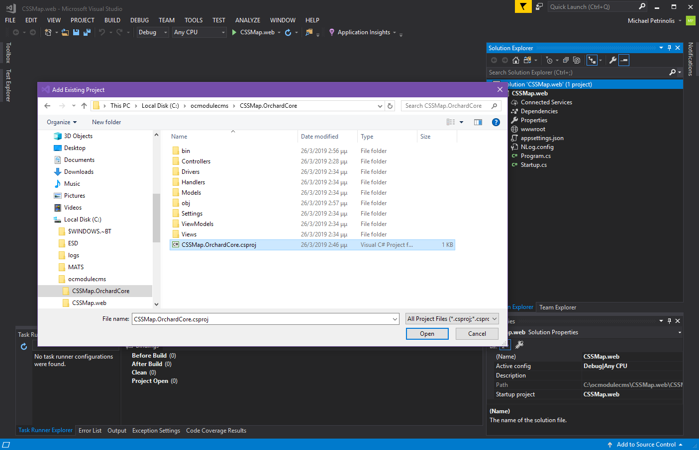
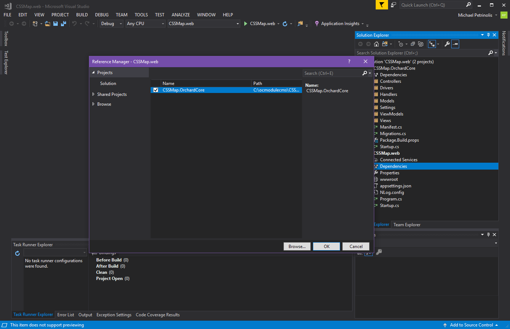
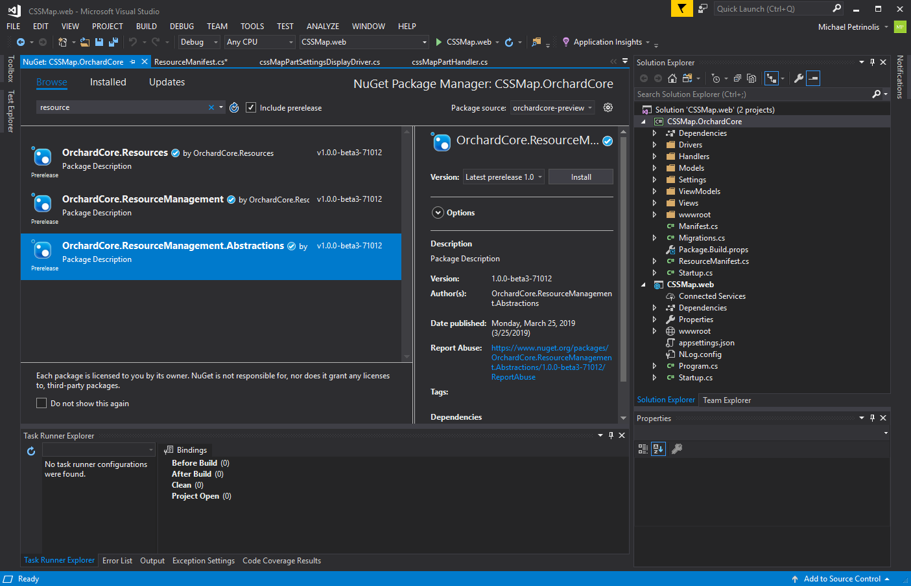

# Extend Orchard Core widgets with a CMS module

In this guide, you will create a module which defines reusable Orchard Core widgets and a custom part. You will create widgets for the free maps from [CSSMAP PLUGIN](https://cssmapsplugin.com/).

## What you will need

You must [create a CMS application](../create-cms-application/index.md) as described in the guide. Below are some quick steps

Open a command prompt, create a directory and navigate to it
```
mkdir c:\ocmodulecms
cd c:\ocmodulecms
```

run the following command to create a web site to test your module.

```dotnet new -i OrchardCore.ProjectTemplates::1.0.0-* --nuget-source https://www.myget.org/F/orchardcore-preview/api/v3/index.json```

```dotnet new occms -n CSSMap.web```

run the app by running
```dotnet run --project .\CSSMap\CSSMap.web.csproj```
and select the Coming Soon theme from the list

## Create the project with the custom part

```dotnet new ocmodulecms -n CSSMap.OrchardCore -P cssMap```

You should have a structure like this 

```
    Directory: C:\ocmodulecms


Mode                LastWriteTime         Length Name
----                -------------         ------ ----
d-----        26/3/2019   2:28 μμ                CSSMap.OrchardCore
d-----        26/3/2019   2:29 μμ                CSSMap.web
```

delete unecessary files created with the module generator

```rd ./CSSMap.OrchardCore/Controllers```

```rd ./CSSMap.OrchardCore/Views/Home```

run ```.\CSSMap.web\CSSMap.web.csproj``` to open the CMS app with VS2017.

Add the module to the solution. 
Then add a reference from CSSMap.web project to CSSMap.OrchardCore  Modify Startup.cs and remove the route to the controller you deleted.
```
public override void Configure(IApplicationBuilder builder, IRouteBuilder routes, IServiceProvider serviceProvider)
{
    routes.MapAreaRoute(
        name: "Home",
        areaName: "CSSMap.OrchardCore",
        template: "Home/Index",
        defaults: new { controller = "Home", action = "Index" }
    );
}
```

## Integrate JS and CSS assets
Download World Continents from [CSSMAP PLUGIN](https://cssmapsplugin.com/get/continents/). Create a wwwroot folder under CSSMap.OrchardCore project and extract the assets you downloaded.

## Register the JS and CSS as resources
Add the OrchardCore.ResourceManagement.Abstractions package to your Module.  Then add a class with name ResourceManifest.cs and define the script and css as named resources in it.
```
using OrchardCore.ResourceManagement;

namespace CSSMap.OrchardCore
{
    public class ResourceManifest : IResourceManifestProvider
    {
        public void BuildManifests(IResourceManifestBuilder builder)
        {
            var manifest = builder.Add();

            manifest
                .DefineScript("cssmap")
                .SetDependencies("jQuery")
                .SetUrl("~/CSSMap.OrchardCore/Scripts/cssmap-continents/jquery.cssmap.min.js")
                .SetVersion("5.5.4");

            manifest
                .DefineStyle("cssmap-continents")
                .SetUrl("~/CSSMap.OrchardCore/Styles/cssmap-continents/cssmap-continents/cssmap-continents.css")
                .SetVersion("5.5.4");

        }
    }
}
```

Modify Startup.cs and register the Resource Manifest with the DI. Also register  the Migrations. This is how the Startup.cs should look like.
```
using System;
using Microsoft.AspNetCore.Builder;
using Microsoft.AspNetCore.Routing;
using Microsoft.Extensions.DependencyInjection;
using OrchardCore.Data.Migration;
using OrchardCore.Modules;
using OrchardCore.ResourceManagement;

namespace CSSMap.OrchardCore
{
    public class Startup : StartupBase
    {
        public override void ConfigureServices(IServiceCollection services)
        {
            services.AddScoped<IResourceManifestProvider, ResourceManifest>();
            services.AddScoped<IDataMigration, Migrations>();
        }

        public override void Configure(IApplicationBuilder builder, IRouteBuilder routes, IServiceProvider serviceProvider)
        {
        }
    }
}
```

## Define the cssMapPart properties and settings
In order to draw a map on screen, it is mandatory to give an Id, some options and the markup as described in the documentation of [CSSMAP PLUGIN](https://cssmapsplugin.com). Also when you add the Part to a widget, you need to setup what map we will display. Let's see the definition of the ContentPart first.
* Model (/Models/cssMapPart)
```
using OrchardCore.ContentManagement;

namespace CSSMap.OrchardCore.Models
{
    public class cssMapPart : ContentPart
    {
        /// <summary>
        /// The Id of the Map
        /// </summary>
        public string Id { get; set; }
        /// <summary>
        /// Options used in Initialization
        /// </summary>
        public string Options { get; set; }
        /// <summary>
        /// The markup
        /// </summary>
        public string Markup { get; set; }
    }
}
```
* ViewModel (/ViewModels/cssMapPartViewModel)
```
using Microsoft.AspNetCore.Mvc.ModelBinding;
using CSSMap.OrchardCore.Models;
using System.ComponentModel.DataAnnotations;

namespace CSSMap.OrchardCore.ViewModels
{
    public class cssMapPartViewModel
    {
        [Required(AllowEmptyStrings = false, ErrorMessage = "Id is required")]
        public string Id { get; set; }
        [Range(1, int.MaxValue, ErrorMessage = "The size must be greater that 0")]
        public string Options { get; set; }
        public string Markup { get; set; }
        [BindNever]
        public cssMapPart cssMapPart { get; set; }
        [BindNever]
        public cssMapPartSettings Settings { get; set; }
    }
}
```
* Edit View (Views/cssMapPart.Edit.cshtml)
```
@using CSSMap.OrchardCore.ViewModels;
@model cssMapPartViewModel

<fieldset class="form-group" asp-validation-class-for="Id">
    <label asp-for="Id">@T["Id"]</label>
    <div class="input-group">
        <input asp-for="Id" class="form-control" />
        <span asp-validation-for="Id"></span>
    </div>
    <span class="hint">@T["The Id of the map's HTMLElement."]</span>
</fieldset>

<fieldset class="form-group" asp-validation-class-for="Markup">
    <label asp-for="Markup">@T["Markup"]</label>
    <div class="input-group">
        <textarea asp-for="Markup" class="form-control content-preview-text" rows="10" ></textarea>
        <span asp-validation-for="Markup"></span>
    </div>
    <span class="hint">@T["The markup used to draw the map."]</span>
</fieldset>

<fieldset class="form-group" asp-validation-class-for="Options">
    <label asp-for="Options">@T["Options"]</label>
    <div class="input-group">
        <textarea asp-for="Options" class="form-control content-preview-text" rows="10" ></textarea>
        <span asp-validation-for="Options"></span>
    </div>
    <span class="hint">@T["The initialization options for the map."]</span>
</fieldset>
```

